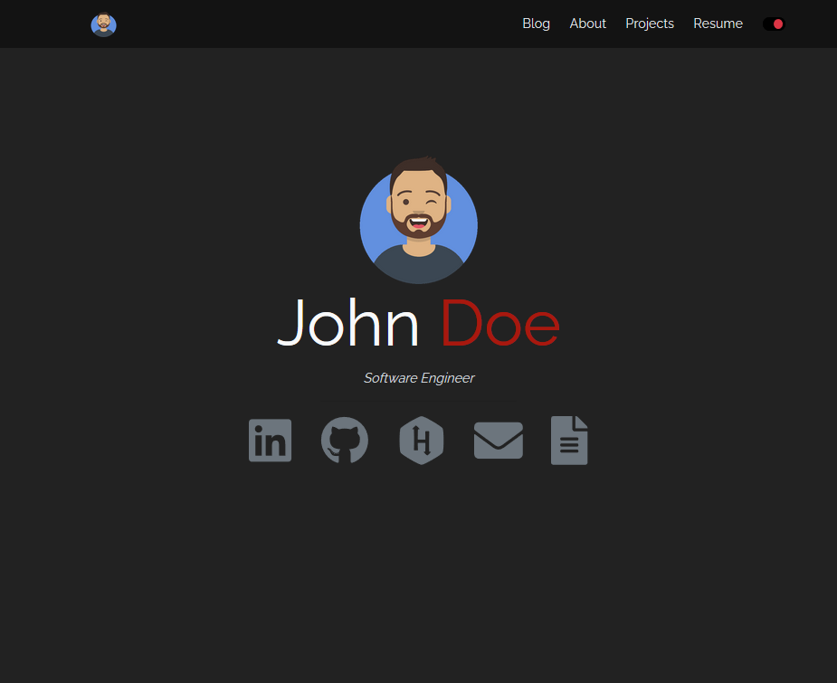
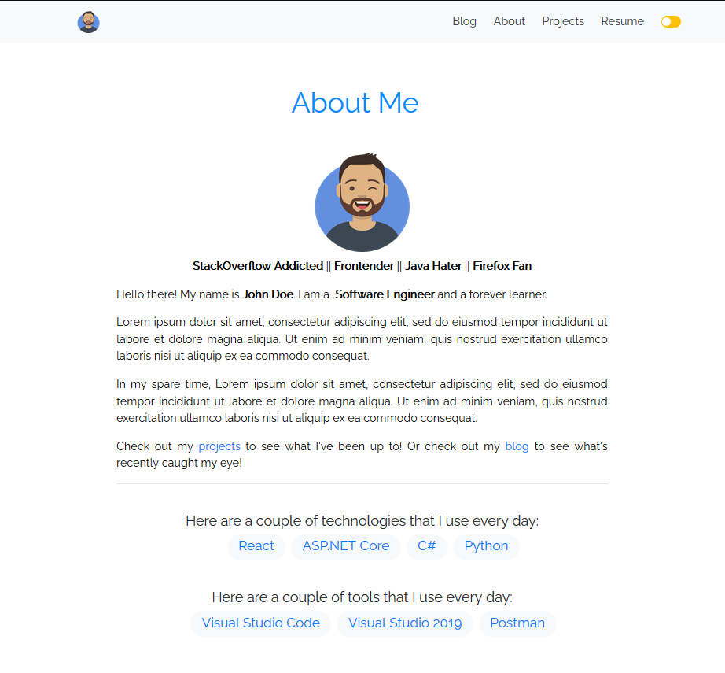

# How to use it

npm i -g gatsby-cli
gatsby new your-site-name https://github.com/kasuken/gatsby-developer-site-template.git
cd your-site-name && gatsby develop

# Screenshots
Light

Dark

About page
