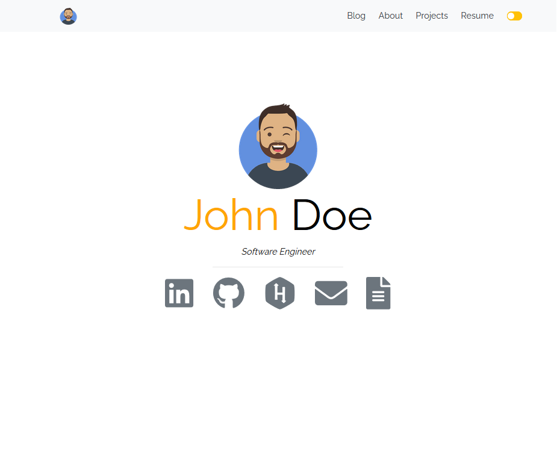

# How to use it

```
npm i -g gatsby-cli
gatsby new your-site-name https://github.com/kasuken/gatsby-developer-site-template.git
cd your-site-name && gatsby develop
```

# Screenshots
Light

Dark

About page


# 🎓 Learning Gatsby

Looking for more guidance? Full documentation for Gatsby lives [on the website](https://www.gatsbyjs.org/). Here are some places to start:

- **For most developers, we recommend starting with our [in-depth tutorial for creating a site with Gatsby](https://www.gatsbyjs.org/tutorial/).** It starts with zero assumptions about your level of ability and walks through every step of the process.

- **To dive straight into code samples, head [to our documentation](https://www.gatsbyjs.org/docs/).** In particular, check out the _Guides_, _API Reference_, and _Advanced Tutorials_ sections in the sidebar.

# 💫 Deploy

[](https://app.netlify.com/start/deploy?repository=https://github.com/kasuken/gatsby-developer-site-template)
